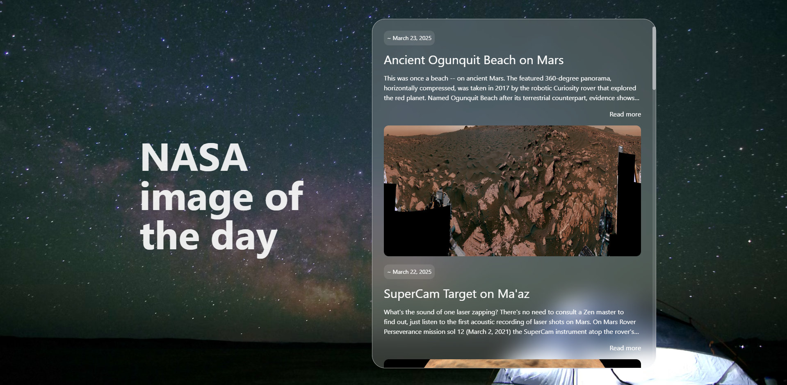

# NASA Image of the Day

A modern web application that displays NASA's Astronomy Picture of the Day (APOD) in an elegant, infinite-scrolling feed.



## Features

- **Infinite Scrolling**: Automatically loads older images as you scroll down
- **Expandable Content**: Click "Read more" to expand the full explanation of each image
- **Responsive Design**: Optimized for both desktop and mobile viewing
- **Modern UI**: Clean interface with glass morphism styling and smooth animations

## Technologies Used

- **Angular**: Frontend framework
- **Angular Signals**: For reactive state management
- **TailwindCSS**: For styling
- **NASA APOD API**: Source for the astronomy images and data

## How It Works

1. The application fetches the most recent astronomy pictures from NASA's APOD API
2. Images are displayed in a chronological feed with the most recent at the top
3. As you scroll to the bottom, older images are automatically loaded
4. Clicking "Read more" expands the truncated descriptions

## API Details

This project uses NASA's Astronomy Picture of the Day (APOD) API:

- Base URL: `https://api.nasa.gov/planetary/apod`
- Parameters used:
  - `api_key`: Your NASA API key
  - `start_date`: Beginning date for image range
  - `end_date`: Ending date for image range

You can get your own API key at [https://api.nasa.gov](https://api.nasa.gov)

## Getting Started

### Prerequisites

- Node.js (v14+)
- npm or yarn

### Installation

1. Clone the repository:

```bash
git clone https://github.com/yourusername/nasa-posting-day.git
cd nasa-posting-day
```

2. Install dependencies:

```bash
npm install
```

3. Create an environment file with your NASA API key or update the key in app.component.ts

4. Start the development server:

```bash
ng serve
```

5. Open your browser to `http://localhost:4200`

## Project Structure

- `src/app/app.component.ts` - Main component logic
- `src/app/app.component.html` - Application template
- `src/app/app.component.css` - Component-specific styles
- `src/app/interfaces/posts.ts` - Interface for NASA post data

## Future Enhancements

- Individual post detail pages
- Favorites/bookmarking functionality
- Search and filter options
- Dark/light theme toggle

## License

This project is licensed under the MIT License - see the LICENSE file for details.

## Acknowledgments

- NASA for providing the APOD API
- Angular team for the framework and tools
